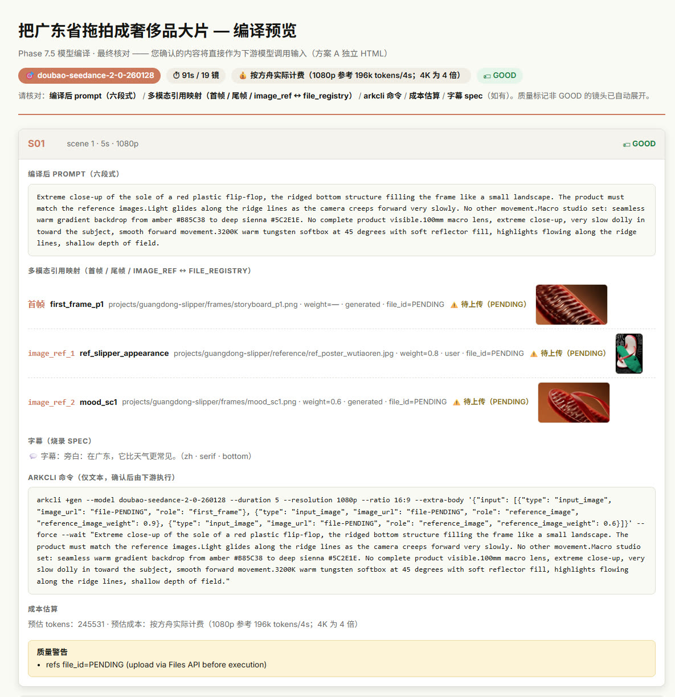
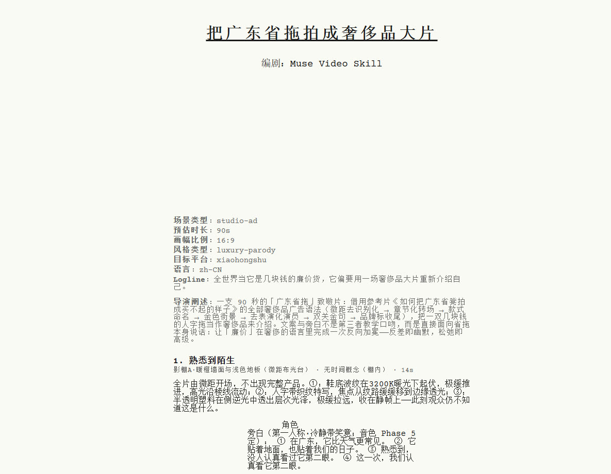
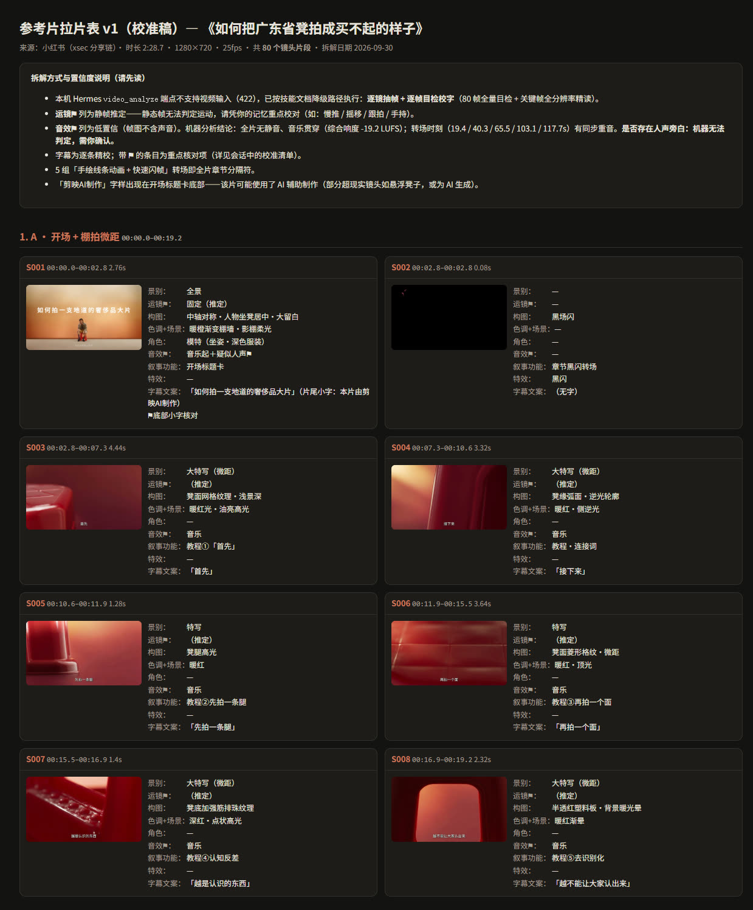

[简体中文](README.md) ｜ **English**

# Muse Video — Virtual Film-Crew Engine for Video Creation

Everything a video needs before it shoots: script, storyboard, art direction and prompts — compiled into model-ready call instructions for downstream video models. A 38-case technique library × a six-role crew, as your virtual film crew.

> Virtual film-crew engine for video creation — idea → script, storyboard, art direction, prompts → model-ready call instructions. 38-case technique library × six-role crew × end-to-end review gates.
> Status: under development ｜ Universal Agent Skill (works with any skills-capable AI agent)

---

## What It Solves

| Pain point | How Muse Video handles it |
|------------|---------------------------|
| Great idea, but no professional storyboard skills | Hollywood-format script + 6/9-grid storyboard + tech breakdown — four export formats in one pass |
| You know the style you want but can't describe it | A 38-case technique library — saying "like Apple 1984" beats describing "dystopian blue-grey tones" |
| Endless revision rounds, and it still sprawls | An 8+1 phase pipeline — Director reviews ≤2 rounds per phase, every output traceable via `_meta` |
| A beautiful treatment a model still can't run | Phase 7.5 Model Compiler: six-part prompt + multimodal reference mapping + call commands + cost estimate (Seedance 2.0 adapted) |
| Reference images everywhere, mismatched | Reference-image chain + asset registry (characters / products / key shots / props) — cited by asset ID end-to-end |

---

## How to Use

In any agent that supports Agent Skills, just talk to it:

```
Plan a product ad for me, in the style of Apple "Don't Blink"
```

```
Help me develop a storyboard for a sci-fi short — that Blade Runner sense of monumentality
```

The agent matches case techniques → injects role prompts → runs the pipeline → exports the Creative Package.

---

## What You Get

| Component | Content |
|-----------|---------|
| Script | Scenes / dialogue / action / camera language (literary-script HTML export, industry Courier format) |
| Storyboard | 6/9-grid panels: description / camera / lighting / art direction / VFX / image prompts |
| Art direction | Color palette (hex + causal notes) + style refs + scene composition + character design |
| Prompts | Per-panel image prompts and full-film video prompt material |
| Subtitles | Text (zh / en / bilingual) × font family × position — decoupled from visual prompts, compiled to burn-in specs |
| Audio route | Route selection + generation briefs for music / voice / SFX (decoupled — no generation performed) |
| Model call instructions | Phase 7.5 compilation: six-part prompt + multimodal refs + arkcli commands + cost estimate + downstream configs (ComfyUI / HyperFrames / Kling) |

Full examples in [`assets/examples/`](assets/examples/) — a sci-fi short and a studio ad, both complete with HTML / Excel exports. For a full real-project walkthrough, see the "Project Showcase" below.

---

## Rendered Shots

> GIF previews of three rendered shots (silent loops); click to watch the MP4 originals in your browser (S2 / S3 with stereo audio).

[](https://luojiangyong.com/muse-video-skill/docs/preview/guangdong-slipper/renders/s1/shot_p3.mp4)

**S1 · Shot 3 — Studio macro** — glass-like translucency under amber studio light

[](https://luojiangyong.com/muse-video-skill/docs/preview/guangdong-slipper/renders/s2/shot_p5.mp4)

**S2 · Shot 5 — Design reveal** — red / white / green concept sketches on a technical drawing

[](https://luojiangyong.com/muse-video-skill/docs/preview/guangdong-slipper/renders/s3/shot_p10.mp4)

**S3 · Shot 10 — Seaside macro** — golden-hour backlight on sand texture

---

## Project Showcase

> These 6 real screenshots come from one complete 8+1 phase test run — a 90-second studio ad, "Guangdong Slippers, Shot Like a Luxury Blockbuster": from reference-video deconstruction (Phase 1) to model compilation (Phase 7.5), all produced by this Skill. Click 01–04 and 06 to open the full pages in your browser.

[](https://luojiangyong.com/muse-video-skill/docs/preview/guangdong-slipper/exports/storyboard.html)

**01 · Storyboard overview** — 19 shots on a 3×3 grid; every panel carries frame / description / subtitles / camera / VFX / approval status

[](https://luojiangyong.com/muse-video-skill/docs/preview/guangdong-slipper/exports/storyboard.html)

**02 · Storyboard mid-section** — macro / character / street scenes; frames and description layers continue

[](https://luojiangyong.com/muse-video-skill/docs/preview/guangdong-slipper/exports/compilation-preview.html)

**03 · Compilation preview (Phase 7.5)** — six-part prompt / multimodal reference mapping (first frame · last frame · image_ref) / arkcli commands / cost estimate (19 shots, expandable per shot)

[](https://luojiangyong.com/muse-video-skill/docs/preview/guangdong-slipper/exports/script-literary.html)

**04 · Literary script** — industry-standard Courier format: title page (logline + director's note) + scenes and voice-over


**05 · Covers** — vertical / horizontal covers generated by Seedream

[](https://luojiangyong.com/muse-video-skill/docs/preview/guangdong-slipper/reference/shotlist_v1.html)

**06 · Reference deconstruction (Phase 1)** — breakdown sheet: 80 frames annotated shot by shot (camera / lighting / movement / pacing / sound / subtitles / technique); techniques distilled into role prompts

---

## Pipeline

```
Idea from the user
    │
    ├─ Routing tree → scene type (4 templates + custom) & complexity
    ├─ Load matching case techniques → inject role prompts
    ├─ 8+1 phase pipeline (role output → Director review → next phase)
    └─ Export Creative Package → downstream tools
```

- **Six-role virtual crew**: Director / Writer / DP / Art Director / VFX / Sound Designer — each role documented independently, loaded on demand
- **Two pipelines**: Default (8 phases + 1 reserved, full creative process) / Fast-Track (merged phases for simple requests)
- **Four scene templates**: Studio Ad / Product Demo / Logo Animation / Sci-Fi — extensible

**Not doing**: video rendering/compositing, AI image/video generation — this Skill delivers treatments and call instructions; actual generation belongs to downstream tools (HyperFrames / ComfyUI / Kling / Volcengine, etc.).

---

## Gates / Confirmation Points

| Trigger | Your call | Default |
|---------|-----------|---------|
| Phase 3.5 style proof | Approve palette / style direction from generated images | Skipped if image_gen is unavailable |
| Phase 3.5 asset gate | Whether & which key assets (characters / products) to generate | Candidate list first, then ask |
| Phase 6 storyboard | Whether to generate storyboard images via image_gen | Explicitly asked |
| Phase 7 HTML storyboard | **The single final gate** — confirm to lock (four options + default) | Review, then confirm |
| Phase 7.5 compilation preview | Second confirmation of model call instructions (+ audio model guidance) | Compilation-preview HTML for review |

---

## Case Library

38 benchmark cases with six role-oriented technique indexes (narrative / camera / color & art / VFX / sound / advertising):

| Type | Count | Examples |
|------|-------|----------|
| Commercial | 25 | Apple 1984 / Guinness Surfer / Honda Cog / Sony Balls |
| Film | 4 | Blade Runner 2049 / In the Mood for Love / The Wandering Earth / Pacific Rim |
| Logo animation | 3 | NIO 10th Anniversary / Apple Event collection / Pixar Luxo Jr. |
| Short film | 2 | ACHROMA / Cosmos Laundromat |
| Others | 4 | Piper (animation) / Koyaanisqatsi (documentary) / Machine Hallucination (experimental) / The One Moment (music video) |

> Full registry + technique cross-reference → [`references/cases/INDEX.md`](references/cases/INDEX.md)

---

## Repository Structure

```
muse-video-skill/
├── SKILL.md                    ← Routing hub (entry point)
├── CONSTITUTION.md             ← Design constitution (5 principles + data flow + forbidden patterns)
├── README.md / README.en.md    ← Project page (Chinese / English)
├── LICENSE                     ← MIT
├── .github/workflows/          ← CI quality gate (syntax / index / contracts)
├── docs/                       ← Project showcase (real screenshots + Pages preview packages)
├── references/                 ← Domain knowledge (loaded on demand)
│   ├── cases/                  ← 38 benchmark cases + index + frame assets
│   ├── roles/                  ← 6 role documents
│   ├── scenes/                 ← 4 scene templates + template for new scenes
│   ├── pipelines/              ← 2 pipelines (default / fast-track)
│   └── media/ · meta/ · *.md   ← Image-gen knowledge / checklists / routing & compiler docs
├── scripts/                    ← 9 deterministic scripts (index / validate / assemble / export)
├── assets/
│   ├── schemas/                ← Project State JSON Schema (the only interface between roles)
│   ├── templates/              ← Script / storyboard / export templates (4 export formats)
│   └── examples/               ← 2 complete example projects (with exports)
└── metadata/                   ← fields.yaml / phase_gates.yaml / CHANGELOG
```

---

## Install

This Skill uses the universal Agent Skills format (`SKILL.md`) — any skills-capable AI agent can load it.

**Option 1 · Clone (always latest):**

```bash
git clone https://github.com/LuoJiangYong/muse-video-skill.git
# Drop it into your agent's skills directory, e.g.:
#   Claude Code  → ~/.claude/skills/muse-video/
#   Hermes Agent → ~/.hermes/skills/creative/muse-video/
```

**Option 2 · Hermes Skills Hub:**

```bash
hermes skills install muse-video-skill
```

---

## Development Checks

```bash
python scripts/build_index.py --check --deps   # index integrity + dead-link check (expect 0 errors)
python scripts/inventory.py --json             # file-level inventory (grouped by role)
python scripts/validate_state.py --input <project-state.json> --phase 7   # phase-gate validation
python -m py_compile scripts/*.py              # all scripts compile
```

---

## Credits & Sources

Cases cite their works and creators; technique breakdowns are for study and research. Trademarks, footage and music remain the property of their respective owners.

---

## License

[MIT](LICENSE) © 2026 Jiang Yong Luo

---

## Version

[v0.36.7](metadata/CHANGELOG.md) — Rendered shots (3 clips inline as GIF / MP4 online) + project showcase (screenshots & page previews); 38-case technique library × six-role crew × 8+1 phase pipeline; reference-asset registry, subtitles, audio routing and model compilation (Seedance 2.0).
